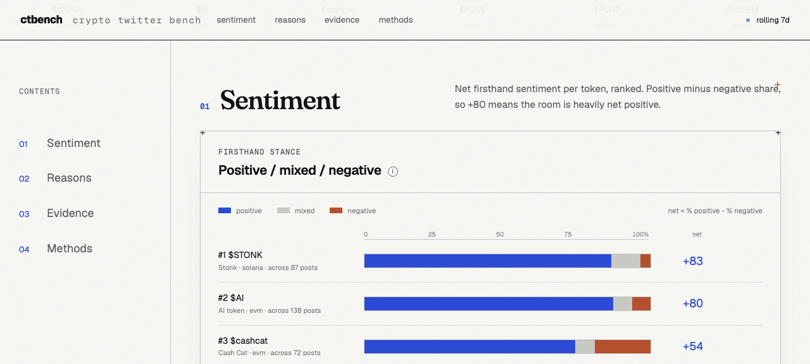
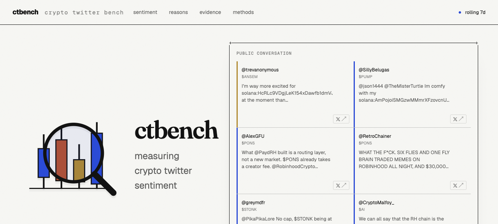

<p align="center">
  
</p>

<p align="center">
  <strong>Live dashboard&nbsp;&rarr;</strong>&nbsp;
  <a href="https://ctbench.vercel.app"><strong>ctbench.vercel.app</strong></a>
  &nbsp;&nbsp;&#183;&nbsp;&nbsp;
  <strong>Star us&nbsp;&#10084;&nbsp;&#8594;</strong>&nbsp;
  <a href="https://github.com/aaronjmars/ctbench/stargazers">GitHub</a>
</p>

<p align="center">
  <strong>Crypto twitter sentiment, one post at a time.</strong><br>
  Reads seven days of X posts about a token, has an LLM judge every post individually, and
  renders a static dashboard where every label is auditable by post id.
</p>

<div align="center">

[](https://github.com/aaronjmars/ctbench/stargazers)
[](https://github.com/aaronjmars/ctbench/network/members)
[](https://ctbench.vercel.app)
[](LICENSE)

</div>

## Preview

Ranked sentiment leaderboard - net firsthand opinion per token:



The homepage: wordmark, tagline and a live mural of the public conversation.



## What it does

ctbench scores the **signal** - people with real exposure saying what they actually think - and
sets aside the hype, shilling and bots that make up most of the volume. It is a crypto rewrite of
[nicodunks/xbench](https://github.com/nicodunks/xbench): same shape (collect &rarr; label &rarr;
aggregate &rarr; static dashboard), pointed at tokens instead of AI models.

- **Auditable by post id** - every headline number traces back to the exact posts and labels behind it.
- **Contract-disambiguated collection** - the search is `(cashtag OR contract-address)`, so the contract
  keeps `$AI` or `$PUMP` from dragging in every unrelated project that shares the ticker.
- **Judged one post at a time** - Claude Code subagents label each post for relevance, bot/shill,
  firsthand exposure, polarity, aspect, stance and stated action.
- **Multi-token leaderboard** - every token is one row in `tokens.json`; drill into any of them.
- **No API keys for the LLM** - labeling runs on your local Claude subscription, not `ANTHROPIC_API_KEY`.

## How it works

`run.sh` chains four standard-library Python scripts. Run them by hand to inspect any stage:

```bash
python3 collect.py       <slug>   # x-cli search      -> data/<slug>/raw/corpus.jsonl
python3 build_batches.py <slug>   # dedupe/slim/split -> data/<slug>/batches/*.jsonl
python3 label.py         <slug>   # claude subagents  -> data/<slug>/labels/*.jsonl
python3 aggregate.py     <slug>   # roll up           -> data/public/<slug>/*.json + index.json
```

- **Collection** pulls posts from X through the [twitterapi.io](https://twitterapi.io) API (not the
  official X API), searching `(cashtag OR contract-address)`.
- **Labeling** fans out up to 4 `claude -p --model haiku|sonnet` subagents at once and **skips batches
  already labeled**, so re-running is cheap and resumable. The judge is told the contract + chain and
  rejects posts about other projects that share the ticker.
- **Aggregation** writes the two files the dashboard reads (`summary.json`, `evidence.json`) and merges
  the token into the leaderboard `index.json`.

## Using the official X API instead

`collect.py` is the **only** X-specific step. It writes `data/<slug>/raw/corpus.jsonl` - one JSON post
per line - and everything downstream (`build_batches.py` &rarr; `label.py` &rarr; `aggregate.py`) is
source-agnostic. To run on the official X API rather than twitterapi.io, skip `collect.py` and produce
that same file yourself, then run the remaining three scripts.

Query the [recent search endpoint](https://docs.x.com/x-api/posts/recent-search)
`GET https://api.x.com/2/tweets/search/recent` with a bearer token. It covers the last 7 days, which
matches the default window:

```bash
curl -H "Authorization: Bearer $X_BEARER_TOKEN" -G \
  "https://api.x.com/2/tweets/search/recent" \
  --data-urlencode 'query=($MYTOKEN OR "0xcontract...") -is:retweet' \
  --data-urlencode 'max_results=100' \
  --data-urlencode 'tweet.fields=created_at,public_metrics,referenced_tweets' \
  --data-urlencode 'expansions=author_id' \
  --data-urlencode 'user.fields=username,verified,public_metrics'
```

Note: `-is:retweet` is a valid v2 operator and `$CASHTAG` is the cashtag operator (needs a paid/Pro
tier). Drop the `since:` operator the pipeline uses for twitterapi.io - on v2 you pass `start_time`
instead. Paginate with `meta.next_token`.

Map each returned post into the shape `build_batches.py` reads and append one JSON object per line to
`data/<slug>/raw/corpus.jsonl`:

```jsonc
{
  "id": "2099982036660269282",                 // required
  "text": "$MYTOKEN looking strong",           // required
  "url": "https://x.com/<username>/status/2099982036660269282",
  "created_at": "2026-09-15T18:04:22.000Z",
  "is_reply": false,                            // referenced_tweets has type "replied_to"
  "author": {                                   // from the expanded users list, joined on author_id
    "username": "someone",                      // required
    "verified": false,
    "followers": 1234                           // user.public_metrics.followers_count
  },
  "metrics": { "like_count": 5, "retweet_count": 1 }  // tweet.public_metrics
}
```

Only `id`, `text` and `author.username` are load-bearing; the rest degrade gracefully (empty / `false`).
Then finish the pipeline:

```bash
python3 build_batches.py <slug>
python3 label.py <slug>
python3 aggregate.py <slug>
./run.sh serve            # refresh the dashboard
```

## Requirements

- **Python 3** - standard library only, nothing to `pip install`.
- **A [twitterapi.io](https://twitterapi.io) API key** in `TWITTER_API_KEY` - collection reads X through
  twitterapi.io, the only paid dependency (billed per request, ~1 page ~ 20 posts). Plus the `x-cli`
  collector on your PATH.
- **Claude Code** (`claude` on your PATH), logged in. Labeling uses your Claude subscription, so no API
  key is needed: `npm i -g @anthropic-ai/claude-code`, then run `claude` once to sign in.

## Quick start

```bash
export TWITTER_API_KEY=...     # your twitterapi.io key

./run.sh                       # collect + label every token in tokens.json,
                               # then serve the dashboard on a random port
```

`run.sh` prints a `http://localhost:<port>` link when it starts serving. Open it.

```bash
./run.sh ansem                 # run the pipeline for a single token by slug
./run.sh serve                 # just serve the existing dashboard, no collection
```

## Track your own token

Add an entry to `tokens` in `tokens.json`:

```json
{
  "slug": "mytoken",           // short id, used for folder + URL (a-z0-9-)
  "symbol": "MYTOKEN",         // ticker, shown in the UI as $MYTOKEN
  "name": "My Token",          // display name
  "chain": "solana",           // "solana" or "evm" (passed to the judge)
  "contract": "So1111...",     // the token's contract address (disambiguates)
  "cashtags": ["$MYTOKEN"]     // one or more cashtags to search
}
```

Then run it:

```bash
./run.sh mytoken
./run.sh serve                 # refresh the dashboard
```

The `contract` is searched alongside the cashtag and handed to the judge, which drops off-contract posts.

## Configuration (`tokens.json`)

Global keys sit next to `tokens`:

| key                     | default  | meaning                                                   |
|-------------------------|----------|-----------------------------------------------------------|
| `collect.since_days`    | `7`      | how far back to search                                    |
| `collect.max_pages`     | `25`     | page cap per token (~20 posts/page, so ~500 posts)        |
| `collect.drop_retweets` | `true`   | add `-is:retweet` to the query                            |
| `batch_size`            | `100`    | posts per labeling batch (one `claude` call each)         |
| `label_model`           | `haiku`  | `haiku` (cheap, fast) or `sonnet` (stricter, slower)      |

## Scoring

`sentiment_score` (-100..100) counts **signal only**: posts that are relevant + firsthand + non-shill.
Shill/bot and pure hype are tracked and shown in the evidence, but excluded from the headline. The score
is `100 * (positive - negative) / (positive + negative + mixed)` over that signal set, so a small `n`
means a noisier number.

## The judge

`CLASSIFICATION_PROMPT.md` is the full contract the LLM follows. For each post it decides: relevant,
bot/shill, firsthand, polarity (positive/negative/mixed/none), aspect (`price | narrative | momentum |
tech | tokenomics | community | safety | other`), stance (holder/trader/builder/observer) and any stated
action. Edit that file to change what the judge looks for; the dashboard picks up new aspects
automatically. `aggregate.py` normalizes any off-schema label back to a safe default.

## Data layout

```
data/
  <slug>/
    raw/corpus.jsonl        raw x-cli output
    batches/batch-*.jsonl   slimmed, split for labeling
    labels/batch-*.jsonl    one label object per post
  public/
    index.json              leaderboard (all tokens)
    <slug>/summary.json     scores, aspect + stance breakdowns
    <slug>/evidence.json    every post with its label
```

Only `data/public/` is committed; `raw/`, `batches/` and `labels/` are gitignored (large and rebuildable).

## Dashboard

Static: `index.html` + `ctbench.js`, reading `data/public/`. Serve it over HTTP (`./run.sh serve`, or any
static server) - opening `index.html` from `file://` will not work because it `fetch()`es the JSON. Layout
is a ranked sentiment leaderboard, a "who is talking" stance panel, an aspect radar comparing tokens, a
per-token praise/complaint book, a filterable evidence strip, and a methods chapter. Charts have hover
tooltips; the whole thing is mobile friendly.

`xbench.css` and `swiss.css` are adapted verbatim from nicodunks/xbench (MIT); `redesign.css`,
`index.html` and `ctbench.js` are this repo's.

## Notes and gotchas

- `collect.py` uses `--max-pages` (never `--all`). It grabs the most recent ~500 posts, which tend to
  cluster into the last day or two, so there is not a clean 7-day spread. `aggregate.py` still emits daily
  buckets for when you widen the window.
- twitterapi.io is per-request; deep sweeps add up. `search` authors do not carry a follower count or
  profile image.
- Labeling spends Claude subscription quota, not API credit. `haiku` is the cheap default; switch
  `label_model` to `sonnet` for stricter judging.

## License

MIT (see [`LICENSE`](LICENSE)). Built on [nicodunks/xbench](https://github.com/nicodunks/xbench) (MIT).

---

Built by [Aaron Elijah Mars](https://aaronjmars.com), founder of Aeon and MiroShark &#183; [@aaronjmars](https://github.com/aaronjmars)
